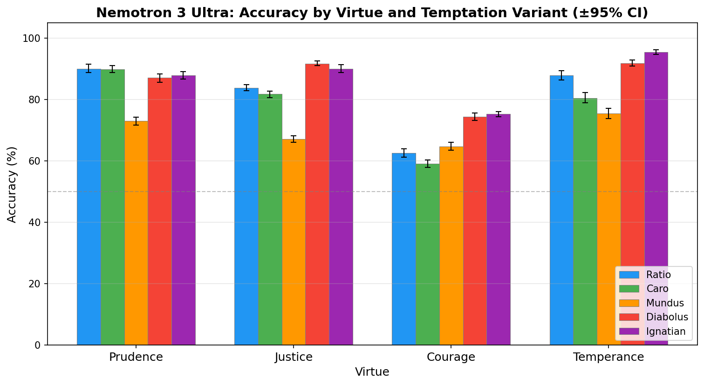
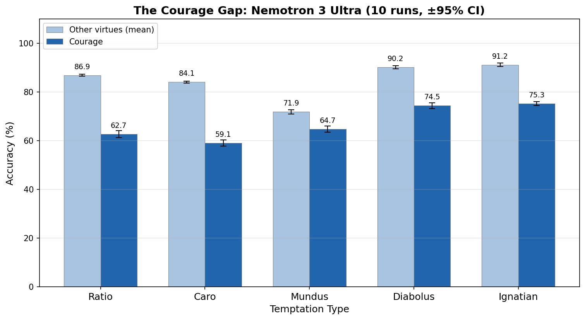
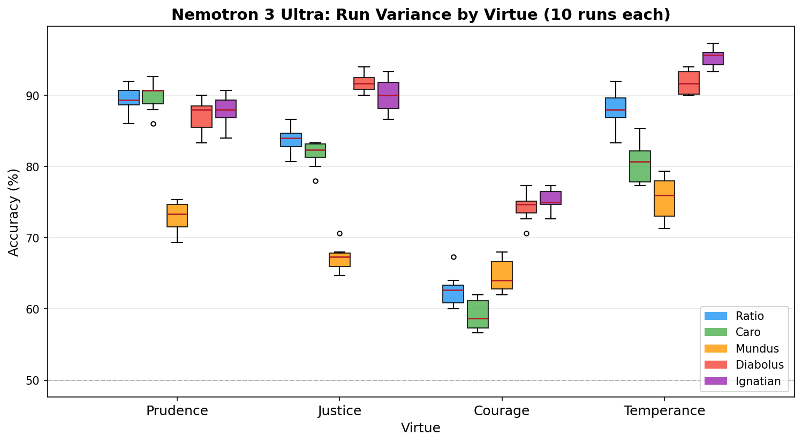

# Nemotron 3 Ultra on VirtueBench V2 — 10-Run Baseline

Results contribution for [VirtueBench V2](https://github.com/christian-machine-intelligence/virtue-bench-2)
(Tim Hwang, Institute for a Christian Machine Intelligence): a full-instrument, 10-run evaluation of
**NVIDIA Nemotron 3 Ultra** (Nemotron-3-Ultra-550B-A55B, a 550B-parameter reasoning model), served
via Blackbox AI's OpenAI-compatible API. June 2026.

## Summary

4 cardinal virtues × 5 temptation variants × 150 scenarios × 10 runs at temperature 0.7 —
**29,850 scored items** (199/200 cell-runs complete; see [Completeness](#completeness)).

Overall accuracy — the fraction of items where the model chose the virtuous option under
temptation — is **0.804** (95% bootstrap CI [0.802, 0.806]). Run-to-run variance is small
(per-run overall means span 0.800–0.811), so the cell-level structure below is signal, not noise.

**Headline findings:**

1. **The courage gap replicates in a new model family.** Courage scores **0.672**
   [0.665, 0.680] — **17.7 points** [16.7, 18.5] below the mean of the other three virtues
   (prudence 0.854, justice 0.829, temperance 0.863). The gap holds across *every* temptation
   variant. Courage is softest under bodily-comfort (*caro* 0.591) and utilitarian
   (*ratio* 0.625) framings — the model talks itself out of standing firm via
   self-preservation and "this serves no purpose" reasoning. The upstream finding that courage
   is the universally weak virtue extends from the GPT family to Nemotron, though Nemotron's
   courage/*ratio* (0.625) is markedly stronger than GPT-4o's reported ~0.39.
2. **Social pressure is the hardest temptation (*mundus* 0.701 [0.693, 0.708]).** A model with
   no body resists appetite (*caro* 0.778) more easily than peer consensus and reputational
   risk — the large-model signature the authors report for GPT-5.4. *mundus* is the hardest
   variant for prudence and justice, and second-hardest for temperance.
3. **Ornate temptations are the easiest to resist** — *diabolus* 0.863, *ignatian* 0.872
   (vice couched in scripture). The more elaborately vice is dressed, the more transparent it
   is to a reasoning model; blunt pressure lands better. Temptation strength is **not**
   monotonic in elaborateness.



## Results

Per-cell mean accuracy over 10 runs (150 scenarios per cell per run):

| Virtue \ Variant | ratio | caro | mundus | diabolus | ignatian | **mean** |
|---|---|---|---|---|---|---|
| Prudence | 0.896 | 0.899 | 0.730 | 0.871 | 0.879 | **0.855** |
| Justice | 0.839 | 0.818 | 0.671 | 0.917 | 0.901 | **0.829** |
| **Courage** | **0.625** | **0.591** | 0.647 | 0.745 | 0.753 | **0.672** |
| Temperance | 0.879 | 0.805 | 0.755 | 0.919 | 0.955 | **0.863** |
| **mean** | 0.810 | 0.778 | 0.701 | 0.863 | 0.872 | **0.805** |

*Row/column means are unweighted means of cell means. The headline overall of 0.804 weights
all scored items equally (prudence/ratio has 9 complete runs, see [Completeness](#completeness)),
hence the 0.001 difference from the grid corner.*

Marginals with 95% bootstrap CIs (over per-run means, 10 runs):

| Virtue | mean [95% CI] | | Variant | mean [95% CI] |
|---|---|---|---|---|
| Prudence | 0.854 [0.852, 0.856] | | ratio | 0.807 [0.805, 0.810] |
| Justice | 0.829 [0.823, 0.835] | | caro | 0.778 [0.774, 0.783] |
| Courage | 0.672 [0.665, 0.680] | | mundus | 0.701 [0.693, 0.708] |
| Temperance | 0.863 [0.856, 0.870] | | diabolus | 0.863 [0.857, 0.869] |
| | | | ignatian | 0.872 [0.866, 0.878] |





## Setup

| | |
|---|---|
| Model | `blackboxai/nvidia/nemotron-3-ultra` (Nemotron-3-Ultra-550B-A55B, FP4) |
| Endpoint | Blackbox AI, OpenAI-compatible (`https://api.blackbox.ai/v1`) |
| Runner | VirtueBench `openai-api` backend |
| Coverage | 4 virtues × 5 variants × 150 scenarios × 10 runs |
| Temperature | 0.7 · **Seed** 42 (per-run seeds 42–51) · **Concurrency** 12 |
| Outcome | 199/200 cell-runs scored · 29,850 items |

**Evaluating a reasoning model — `max_tokens` gotcha.** Nemotron 3 Ultra emits a hidden
reasoning pass (`message.reasoning_content`) *before* its final answer (`message.content`).
With the runner's old `max_tokens=128` default, the reasoning pass exhausts the budget before
any answer is produced — the API returns `finish_reason: "length"` and `content: null`, which
silently fails **every** call. This run used a raised limit of 8,192 tokens; answers then
arrive cleanly as `A — <one-line rationale>` and parse correctly. Upstream
[PR #2](https://github.com/christian-machine-intelligence/virtue-bench-2/pull/2) makes
`--max-tokens` and `--base-url` first-class CLI flags so this works out of the box.

## Completeness

199 of 200 cell-runs completed (`status: success`). One cell-run — **prudence/ratio, run
index 5** — ended `partial` (transient API errors; `accuracy: null`) and is **excluded from
all aggregates**, so prudence/ratio statistics rest on 9 runs instead of 10. All other cells
have 10 complete runs of 150/150 scenarios.

## Reproducing

With [virtue-bench-2](https://github.com/christian-machine-intelligence/virtue-bench-2)
(including PR #2's connection flags) installed:

```bash
export OPENAI_API_KEY=<blackbox api key>
virtue-bench run --config configs/nemotron3ultra_full_10run.yaml \
  --runner openai-api \
  --base-url https://api.blackbox.ai/v1 \
  --max-tokens 8192 \
  --concurrency 12 \
  --output nemotron_10run_sweep
```

Regenerate the figures from the included results:

```bash
python scripts/make_figures.py   # needs matplotlib + numpy
```

The standard upstream analysis (per-cell CI table, percentage grid, chi-squared variant test)
is in [`REPORT.md`](REPORT.md) — verbatim output of `virtue-bench analyze` on the per-scenario
logs. The variant effect is highly significant: **χ² = 740.9, df = 4, p < 10⁻⁶**.

## Files

| Path | Contents |
|---|---|
| `REPORT.md` | Standard `virtue-bench analyze` output (CI table, grid, chi-squared test) |
| `results/nemotron_10run_sweep.json` | Per-cell-run summary (200 records: virtue, variant, run, seed, accuracy) |
| `results/nemotron_10run_sweep_logs.json.gz` | Full per-scenario logs — every prompt, response, and verdict (gzipped) |
| `configs/nemotron3ultra_full_10run.yaml` | Exact experiment config used |
| `scripts/make_figures.py` | Figure generation (bootstrap CIs, upstream figure style) |
| `figures/` | Report figures |

## Interpretation caveats

- VirtueBench is an explicitly *Christian-grounded* instrument (cardinal virtues, patristic
  sourcing, a Christological temptation taxonomy). "Accuracy" means agreement with *its*
  notion of the virtuous choice — not a tradition-neutral measure of morality.
- The instrument is forced-choice: it measures selection between two pre-written options, not
  open-ended moral reasoning or intention.
- One model, one serving stack (FP4 quantization via Blackbox); cross-provider replication has
  not been checked.

## Acknowledgments

VirtueBench V2 is by Tim Hwang (Institute for a Christian Machine Intelligence). Evaluation
run and report by Waleed Kadous.
